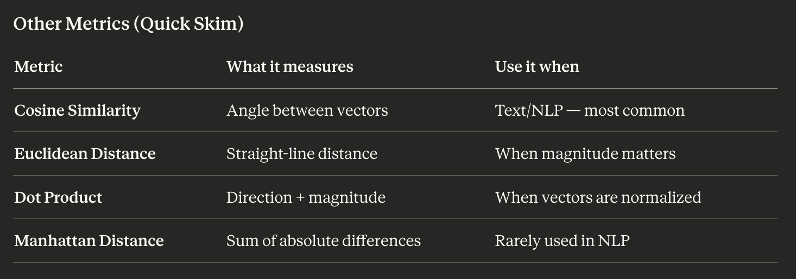
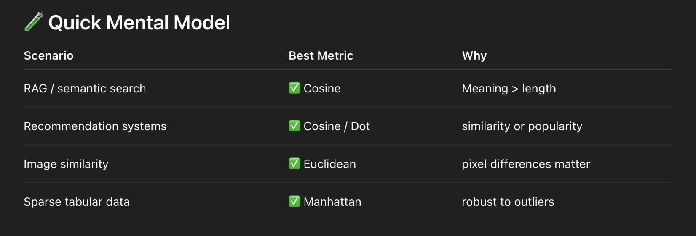
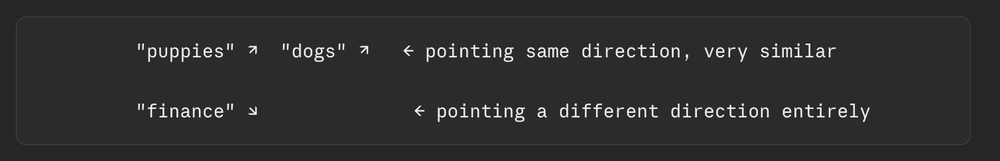
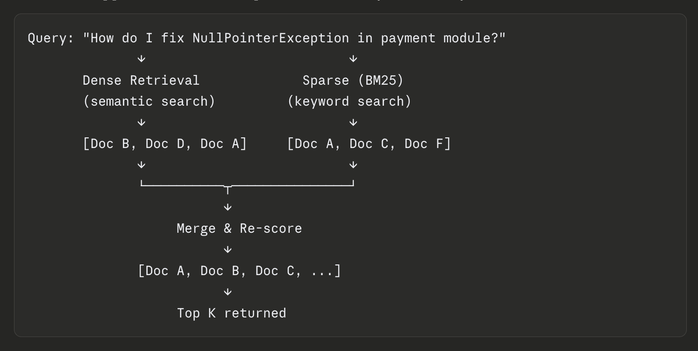
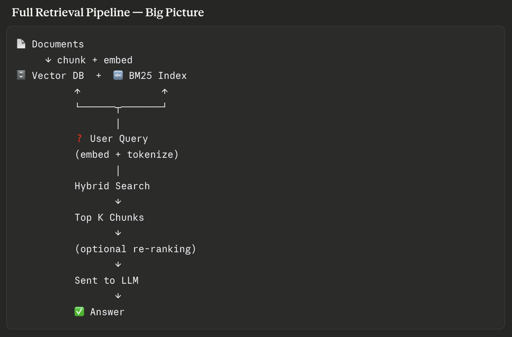

- A vector embedding is just a list of numbers that represents the meaning of a piece of text. 
    - Similarity between 'I love dogs' and 'I love dogs': 1.0000
    - Similarity between 'I love dogs' and 'I adore puppies': 0.6831
    - Similarity between 'I love dogs' and 'Stock markets fell': 0.0197
    - Similarity between 'I adore puppies' and 'I love dogs': 0.6831
    - Similarity between 'I adore puppies' and 'I adore puppies': 1.0000
    - Similarity between 'I adore puppies' and 'Stock markets fell': 0.0349
    - Similarity between 'Stock markets fell' and 'I love dogs': 0.0197
    - Similarity between 'Stock markets fell' and 'I adore puppies': 0.0349
    - Similarity between 'Stock markets fell' and 'Stock markets fell': 1.0000

Demo code reference: https://github.com/HiteshRepo/ai-practice-projects/blob/main/embedding-and-rag/snippets/01_cosine_similarity.py

- once you have two vectors, how do you measure how close they are? 
    - You have two vectors (embeddings). You want to know — how similar are they?
    - That's what distance metrics do. They give you a single number that says "these two things are very similar" or "these two things are totally different."
    - Why Not Just Subtract? - Because we care more about direction than size. The vectors will have very different magnitudes (sizes) — but they're pointing in the same direction. They mean the same thing, just one is more verbose.
    - The vectors will have very different magnitudes (sizes) — but they're pointing in the same direction. They mean the same thing, just one is more verbose. If they point in opposite directions → angle is 180° → similarity is -1.0 (opposite meaning). If they're perpendicular → angle is 90° → similarity is 0 (unrelated)
    - In RAG, you compute cosine similarity between the query vector and every document vector, then return the top matches.

    
    

    Think of embeddings as arrows pointing in a high-dimensional space.

    

    Cosine similarity just asks: are these arrows pointing the same way?

Demo code reference: https://github.com/HiteshRepo/ai-practice-projects/blob/main/embedding-and-rag/snippets/02_why_cosine.py

- A vector database is a specialized database built to store and search vectors very fast — even at millions of records.
    - You've embedded 100,000 documents. Each one is a vector with 1,536 numbers. Now a user asks a question — you embed that too, and you need to find the top 5 most similar vectors out of 100,000. You could compare the query vector against every single document vector one by one. That's called brute force search and it works fine for small datasets. But at scale — millions of documents — it becomes way too slow.

    - They are fast because they use something called ANN — Approximate Nearest Neighbor search. Instead of checking every single vector, ANN algorithms organize vectors into smart structures at index time, so at query time they only check a small fraction — and still return results that are almost always the correct top matches. The tradeoff: a tiny loss in accuracy for a massive gain in speed. In practice, this is completely fine for RAG. Think of it like a library. Instead of reading every book to find what you need, the library has an index + sections so you go directly to the right shelf.

Demo code reference: https://github.com/HiteshRepo/ai-practice-projects/blob/main/embedding-and-rag/snippets/03_vector_db.py

- Approximate Nearest Neighbor
    - Exact Nearest Neighbor (Slow way, but accurate)
        - Compare your query vector with every single vector
        - Compute similarity (e.g., cosine similarity)
        - Pick the closest
    - Approximate Nearest Neighbor (Fast way, Slightly less accurate but usually good enough)
        - Skips most vectors
        - Looks only in promising regions
        - Returns very close (but not always perfect) results
    - ANN uses clever data structures to avoid brute force:
        -  Clustering: group similar vectors
            - Group vectors into clusters
            - Only search within relevant clusters
        - Graph-based search
            - Each vector connects to similar neighbors
            - You "walk" through the graph to find closest
        - Hashing (LSH)
            - Convert vectors into buckets
            - Similar vectors land in same bucket

Demo code reference: https://github.com/HiteshRepo/ai-practice-projects/blob/main/embedding-and-rag/snippets/04_enn_vs_ann.py

- Chunking Strategies
    - You can't embed an entire 50-page document as one vector.
        - Embedding models have a token limit
        - One giant vector loses specificity
        - You want to retrieve precise passages, not entire books
    - The goal is simple — chunks should be small enough to be specific, but large enough to carry context.
    - Why Chunking Quality Matters So Much: Bad chunking → bad retrieval → bad answers. Even if your LLM is excellent.
    - Strategies:
        - Fixed Size Chunking: Easy to implement, Breaks sentences and context
        - Fixed Size with Overlap: Simple, prevents hard cuts, Redundant storage, still not semantically aware
        - Sentence / Paragraph Chunking: Respects natural language structure, Chunks can vary wildly in size
        - Recursive Character Splitting: Smart, respects structure, widely used, Works well across different document types
        - Semantic Chunking: Most semantically accurate, Slower, more complex to implement
        - Document-Aware / Structural Chunking: Preserves document intent perfectly, Only works for well-structured documents
    - The Chunking + Metadata Trick: Always store metadata alongside each chunk — not just the vector.
        ```json
        {
            "text": "The drug should not be taken with alcohol.",
            "embedding": [0.1, 0.8, ...],
            "metadata": {
                "source": "drug_manual.pdf",
                "page": 4,
                "section": "Side Effects"
            }
        }
        ```

Demo code reference: https://github.com/HiteshRepo/ai-practice-projects/blob/main/embedding-and-rag/snippets/05_chunking_strategies.py

-  Retrieval Pipelines
    - You have thousands of embedded chunks sitting in your vector database. A user asks a question. How do you find the right chunks to answer it?
    - Dense Retrieval (Vector Search): Embed the query → find chunks with the closest vectors → return top K
        - It works on meaning — so even if the document says "handle null reference error in billing service" instead of "NullPointerException in payment module", it can still match because the meaning is similar.
        -  Great at understanding synonyms and paraphrasing
        - Works across languages
        - Can miss exact keyword matches — especially for rare terms, IDs, error code
    - Sparse Retrieval (Keyword Search): This is the old-school approach — it's been around for decades. The most common algorithm is called BM25. Instead of meaning, it works on exact word matching with smart scoring.
        - The query words appear frequently in the document
        - The document is not too long (long docs get penalized to avoid unfair advantage)
        - The word is rare across all documents (common words like "the" matter less)
        - Example
            ```
            Query: "NullPointerException payment module"

            BM25 scores:
            Doc A: "NullPointerException in the payment module occurs when..." → 0.91 ✅
            Doc B: "Handle null errors in billing..."                         → 0.21
            Doc C: "Payment module setup guide..."                            → 0.44
            ```
    - Hybrid Retrieval (Dense + Sparse Combined): Run both dense and sparse retrieval, then merge and re-score the results.
    
        - How Merging Works — RRF
            - RRF: Each result gets a score based on its rank position in each list. Results that rank well in both lists get the highest final score.
            ```
            Doc A → Rank 3 in dense,  Rank 1 in sparse  → high combined score ✅
            Doc B → Rank 1 in dense,  Rank 8 in sparse  → medium score
            Doc F → Rank 9 in dense,  Rank 2 in sparse  → medium score
            ```
    

Demo code reference: https://github.com/HiteshRepo/ai-practice-projects/blob/main/embedding-and-rag/snippets/06_retrieval_techniques.py

- Re-ranking
    - Retrieval gives you the top K chunks (say top 10). But retrieval is optimized for speed — it's making approximate judgments across millions of vectors very fast.
    - The ordering isn't always perfect. The most relevant chunk might be sitting at position 6, not position 1. And if you're only sending the top 3 chunks to your LLM, you just lost the best one.
    - Re-ranking is a second, slower, more accurate pass that re-orders your retrieved chunks by true relevance to the query.
        ```
        Millions of chunks
            ↓  (retrieval — fast, approximate)
        Top 20 candidates
            ↓  (re-ranker — slow, accurate)
        Top 3-5 best chunks → sent to LLM
        ```
    - The most common re-rankers are Cross-Encoders — small but powerful models.
        ```
        Input:  [Query + Chunk] together
        Output: A single relevance score (0 to 1)
        ```

        ```
        Query: "How do I fix NullPointerException in payment module?"

        Cross-encoder scores:
        Chunk A: "NullPointerException occurs when object is null..."  → 0.94 ✅
        Chunk B: "Payment module setup and configuration guide..."     → 0.41
        Chunk C: "Common Java exceptions and how to handle them..."   → 0.76
        Chunk D: "Billing service null reference troubleshooting..."  → 0.81

        Re-ranked order: A → D → C → B
        ```

        Without re-ranking, your retrieval might have returned B at position 2 because its vector happened to be close. The re-ranker corrects this.

    - Popular Re-ranking Tools: Cohere Rerank, FlashRank / BGE Reranker,

Demo code reference: same as `Retrieval Pipelines`

-  Grounding & Hallucination Reduction
    - LLMs are incredibly fluent. They can write confidently about things that are completely wrong. This is called hallucination — the model generates plausible-sounding but fabricated information.
    - Grounding means anchoring the LLM's answer to real, retrieved source material — so it can't just make things up.
    - RAG is fundamentally a grounding technique. But just doing RAG doesn't automatically eliminate hallucinations. You need to do it right.
    - LLMs don't "know" facts the way a database does. They learned statistical patterns from text. When they don't know something, they don't say "I don't know" — they pattern-match to what sounds right and say it confidently.
    - How RAG Reduces Hallucinations
        ```
        User: "What did our Q3 report say about APAC revenue?"
                ↓
        Retrieve relevant chunks from Q3 report
                ↓
        Prompt: "Answer ONLY using the context below.
                Context: [chunk 1] [chunk 2] [chunk 3]
                Question: What did our Q3 report say about APAC revenue?"
                ↓
        LLM now reads the actual document and answers from it ✅
        ```

        The retrieved chunks act as guardrails.

    - Techniques to prevent hallucinations:
        - Prompt Engineering for Grounding: Strong grounding prompt
        ```
        You are a helpful assistant. Answer the user's question using 
        ONLY the information provided in the context below.

        If the answer is not present in the context, say:
        "I don't have enough information to answer this."

        Do NOT use any outside knowledge.

        Context:
        ---------
        {chunks}
        ---------

        Question: {question}

        Answer:
        ```
        - Citation Forcing: Ask the model to quote the exact chunk it's answering from. If it can't point to a source, it can't answer.
        - Retrieval Quality is Everything: Grounding only works if the right chunks were retrieved.
        - Handling "I Don't Know": Always explicitly tell the model it's allowed to say it doesn't know. By default, LLMs are trained to be helpful — which makes them reluctant to admit ignorance.
        ```
        If the context does not contain enough information to answer 
        confidently, respond with:
        "I don't have enough information in the provided documents to 
        answer this question."
        ```
        - Chunk Validation / Faithfulness Checks: For high-stakes applications, you can add an automated faithfulness check after the LLM answers — a second LLM call that asks:
        ```
        Given this context: {chunks}
        And this answer: {llm_answer}

        Does the answer contain any claims NOT supported by the context?
        Reply YES or NO, and list any unsupported claims.
        ```
            - Tools like RAGAS and TruLens automate this evaluation for you, giving you a faithfulness score across your whole pipeline.

Demo code reference: https://github.com/HiteshRepo/ai-practice-projects/blob/main/embedding-and-rag/snippets/07_hallucinations_grounding.py