# The Evolution: Beyond transformers

## Why the World Went Decoder-Only

First — what the encoder was actually for
In the original paper, the encoder and decoder had a clean division of labour:

- Encoder — read the entire source sentence upfront, build a rich understanding of it, hand it to the decoder as K and V.
- Decoder — generate the output token by token, reading those K and V at every step via cross-attention.

This made sense for translation — you have a complete input sentence in one language, and you're producing a complete output in another. Two distinct jobs, two distinct halves.

But then researchers asked: what if the input and output are the same language? What if you're not translating — you're just continuing text?

The key insight that killed the encoder

For a language model — something that just predicts the next word — you don't need two separate halves. The "understanding the input" and "generating the output" can happen in the same stack, because they're the same operation: predict what comes next given everything before.

What actually changes going decoder-only

Three concrete things change:

1. Cross-attention is removed. There's no encoder to read from, so the cross-attention sub-layer in each decoder block disappears entirely. Each block now only has masked self-attention + feed-forward. Simpler, fewer parameters per layer.
2. The mask changes meaning. In the original decoder, the mask prevented peeking at future output tokens. In a decoder-only model, the mask prevents every token from attending to anything that comes after it in the sequence — whether that's prompt or generated text. This is called causal masking, and it's what makes the model always predict left to right.
3. Prompt and response are treated as one continuous sequence. There's no separation between "source" and "target." Your prompt and the model's response are just tokens in a row. The model sees them all the same way — it just generates whatever comes next.

Every token can see itself and everything before it. Nothing after. This triangle pattern is the causal mask — it's what enforces left-to-right generation and prevents the model from cheating during training.

Why decoder-only turned out to be more powerful

This is the non-obvious part. You'd think removing half the architecture would make it worse. It actually made it better — for three reasons:

1. All parameters go toward one job. An encoder-decoder model splits its capacity — half understands, half generates. A decoder-only model puts everything into one stack that does both. For the same parameter budget, you get a deeper, more capable single stack.
2. It scales better. When researchers started scaling up — more layers, more heads, more parameters — the decoder-only architecture responded better. The encoder-decoder architecture had more moving parts that needed to stay in balance.
3. Everything becomes the same problem. Translation, summarization, question answering, coding, conversation — in a decoder-only model, all of these are just "predict the next token given what came before." The model doesn't need to know which task it's doing. This is the foundation of the general-purpose assistant — one model, any task.

The three Transformer variants, summarised

```csv
Architecture | Used for | Example models
Encoder only | Understanding tasks — classification, search, embeddings | BERT, RoBERTa
Encoder-decoder | Tasks with distinct input/output — translation, summarization | T5, BART, original Transformer
Decoder onlyGeneration — conversation, coding, reasoning, everything | GPT, Claude, Gemini, LLaMA
```

Encoder-only models are still used today — largely for search and retrieval where you need to embed text into vectors. But for general language generation, decoder-only won. And that's what every frontier model today is built on.

Main points:

- The Original "Dual-Team" Approach: Remind readers that the 2017 paper was built for sequence transduction (translation), which required a specialized Encoder to map the input and a Decoder to generate the output.
- The Power of the Auto-Regressive Engine: Highlight that the paper introduced the auto-regressive property—generating one element at a time by consuming previous symbols as input—which is exactly how modern LLMs "chat" with us today.
- The "Vanishing Bridge": Explain that the Encoder-Decoder Attention sub-layer (the "bridge" where the decoder's Query searched the encoder's Key and Values) was the specific part removed to create decoder-only models.
- The Mask Becomes the Master: Discuss how the Masked Multi-Head Attention—originally a technical safeguard to prevent the decoder from "seeing the future" during training—became the primary mechanism for all word processing in modern LLMs.
- From Two Sequences to One: Contrast the original paper's two-sequence system (English input → German output) with the modern approach of treating everything as a single sequence of text, a concept the authors touched upon when discussing self-attention relating different positions of a single sequence.
- Efficiency for Scaling: Revisit the paper's proof that self-attention allows for constant path length (O(1)) between any two words and maximum parallelization. This efficiency is what allowed future researchers to scale the "decoder-only" architecture to the massive sizes we see in models like Claude or GPT-4.
- Fulfilling the Authors' Vision: Conclude by noting that while the paper focused on translation, the authors explicitly planned to apply the Transformer to other tasks like question answering and multimodal AI (images/audio), which has now become a reality through these evolved decoder-only designs.

## Evolution beyond transformers

You now know that attention computes every token against every other token. For a sequence of N tokens, that's N² comparisons. Double the sequence length → quadruple the compute.

For short conversations this is fine. But as context windows grew to 100k, 200k, 1M tokens — the quadratic bottleneck became a serious issue, where simply adding more compute may not be a viable solution for very long context windows. Kingy AI

Researchers asked: can we get Transformer-quality results without the N² cost?

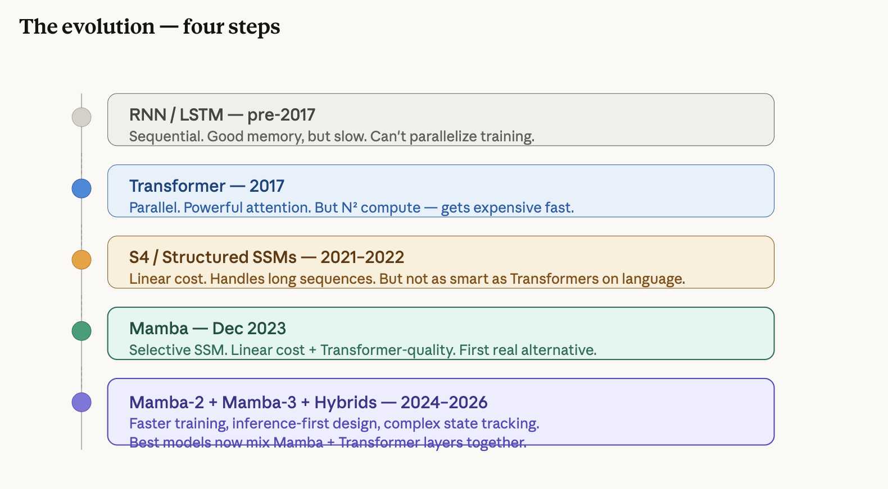

### Step 1 — RNNs (the old way)

You already know this from earlier. Sequential, one token at a time, memory fades over long sequences. Replaced by Transformers in 2017.

### Step 2 — The problem Transformers left unsolved

Transformers fixed the parallelism and long-range dependency problems. But they introduced the N² cost. And they have another hidden cost: the KV cache.
Every token you generate, the model stores its Keys and Values in memory so it doesn't have to recompute them. For long conversations this cache grows linearly — eventually consuming enormous GPU memory. This is why long contexts are expensive to serve.

### Step 3 — SSMs: the idea borrowed from physics

Imagine you're reading a book and someone keeps asking you "what's the mood so far?" You don't re-read the whole book each time. You keep a running impression in your head — and update it as each new sentence comes in.
That's the core idea of an SSM. One small chunk of memory. Gets updated with each new input. Never looks back at the full history.

State Space Models (SSMs) come from control theory — the math used for things like autopilots and cruise control systems. The core idea is completely different from attention:
Instead of every token looking at every other token, an SSM maintains a single hidden state — a compressed summary of everything seen so far. Each new token updates that state and produces an output. Like a running notebook that gets updated as you read, rather than re-reading the whole book every time.

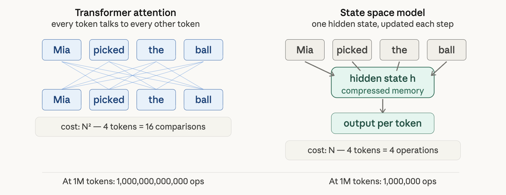

The early SSMs (like S4 in 2022) proved the linear cost was achievable. But they had a fatal flaw: their hidden state updated the same way regardless of input. Every token was processed identically — no selectivity. That made them bad at language, where context changes what matters.

Let's say the model is reading: "Mia was happy. Then she got bad news. She cried."
We'll track one thing: emotional tone — just to make it tangible.

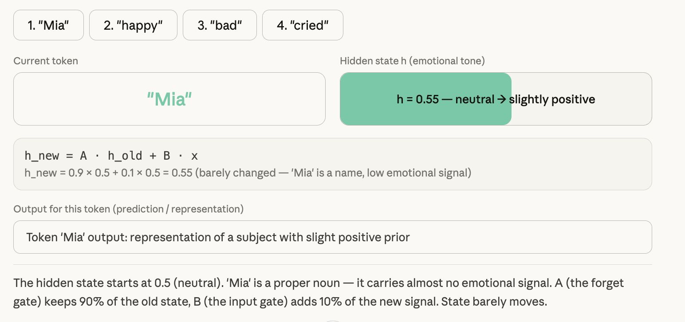
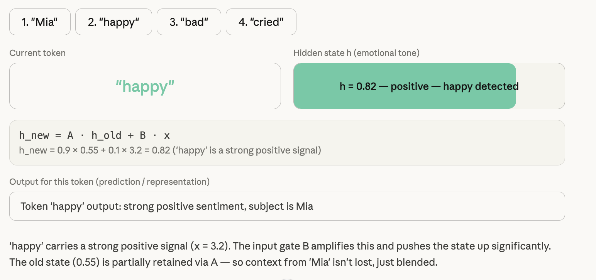
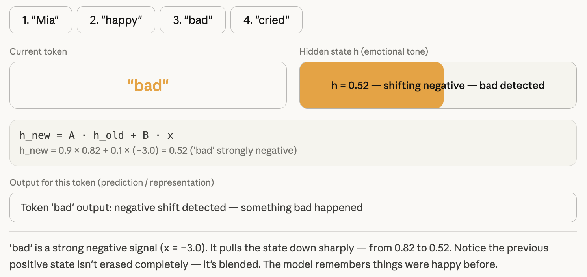
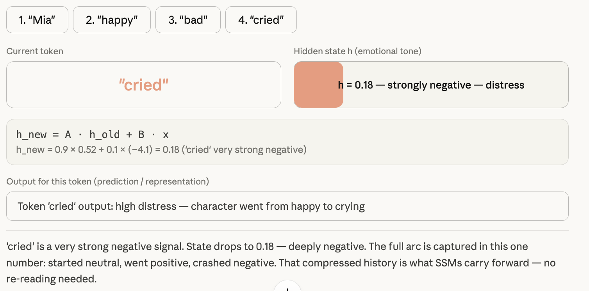

#### The formula — demystified

Every SSM update follows the same two equations:

```
h_new  =  A · h_old  +  B · x       ← update the hidden state
y      =  C · h                      ← produce an output
```

In plain English:

A — how much of the old state to keep. Think of it as memory retention. A=0.9 means "remember 90% of what you knew."
B — how much of the new input x to absorb. B=0.1 means "take in 10% of this new token's signal."
C — how to read the state to produce an output for this token.

That's the entire mechanism. Update state, produce output, move on.

The problem with fixed A and B
Here's where early SSMs fell flat. A and B were fixed numbers — the same for every token, every position, every context.
That means the model forgets at the same rate no matter what it's reading. It pays equal attention to "the" as it does to "cried." It can't decide what's worth remembering.
Imagine a student who highlights every single word in a textbook with equal intensity. Technically they read it all — but they have no sense of what mattered.

### Step 4 — Mamba (Dec 2023): the breakthrough

The key problem with ordinary SSMs is that they have fixed dynamics — the rules governing how the hidden state evolves are the same for every input and at every step. Mamba fixed this by making key parameters functions of the current input token.
In plain terms: the SSM now decides how much to remember and how much to forget based on what it's currently reading. That's the "selective" in Selective State Space Model.
Think of it like two different readers:

- Old SSM = a reader who highlights every sentence with equal intensity, no matter what
- Mamba = a reader who pays close attention to important sentences and skims the rest — and decides which is which on the fly

Mamba enjoys fast inference (5× higher throughput than Transformers) and linear scaling in sequence length, and its performance improves on real data up to million-length sequences. Their Mamba-3B model outperforms Transformers of the same size and matches Transformers twice its size, both in pretraining and downstream evaluation.

Mamba made A and B functions of the input token x itself. They're no longer fixed constants — they're computed fresh for each token.

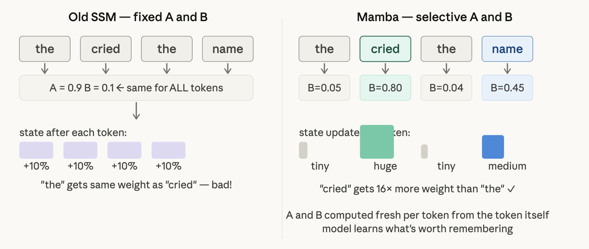

"the" barely updates the state. "cried" updates it massively. The model learned this during training — not because anyone told it, but because selective updates produced better predictions.

SSM vs Transformer — the fundamental tradeoff

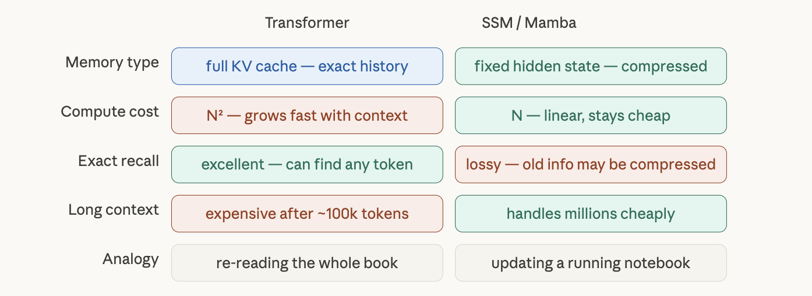

### Step 5 — Mamba-2 (2024): math meets speed

Mamba-2's core layer is a refinement of Mamba's selective SSM that is 2–8× faster, while continuing to be competitive with Transformers on language modeling.

The authors also proved something surprising: Transformers and SSMs are actually quite closely related — these families of models are connected through various decompositions of a well-studied class of structured matrices. Medium Attention and SSMs aren't opposites — they're two points on the same mathematical spectrum.

Mamba-2 focused on training speed. Get models trained faster, cheaper.

Mamba-1 was fast at inference — running the model. But training it was painful. Here's why.

The selective state update h_new = A·h_old + B·x has to be computed one token at a time in sequence — you need h_1 before h_2, h_2 before h_3. This is called a sequential scan. GPUs hate sequential work. They're built for doing thousands of things at once (parallel). A sequential scan leaves most of the GPU sitting idle.

Mamba-2 introduced what they called Structured State Space Duality (SSD) — a chunkwise algorithm that splits the sequence into segments, computes attention-like operations on each segment in parallel, then passes the SSM states between segments.

In plain terms: instead of processing one token at a time, Mamba-2 processes chunks of tokens at once — like mini Transformer blocks — then hands the state off to the next chunk.

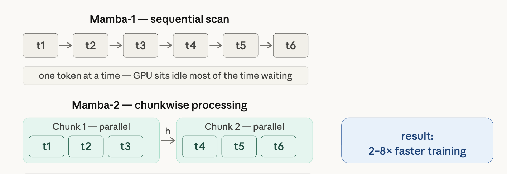

The insight Mamba-2 had: both architectures — SSMs and Transformers — create lower triangular matrices that mix information from past positions to current ones. The SSM matrix has the same mathematical structure as linear attention with specific Q, K, V matrices. They're computing the same linear transformation — one through recursive state updates, the other through direct position-to-position attention.
So Mamba-2 said: if we're mathematically equivalent to attention, let's use attention's faster GPU tricks for training. This efficiency enables Mamba-2 to use much larger hidden state dimensions without slowing the model down, allowing for larger, more powerful, more expressive models.
It also introduced Mamba heads — directly analogous to attention heads. A Mamba block can be split into multiple "Mamba heads" akin to the multiple attention heads in Transformers — one variant, analogous to grouped query attention, enables even more efficiency through tensor parallelism in GPUs.

### Step 6 — Mamba-3 (March 2026, days ago): inference-first

While Mamba-2 focused on breaking pretraining bottlenecks, Mamba-3 aims to solve the "cold GPU" problem: during decoding, modern hardware often remains idle, waiting for memory movement rather than performing computation.

Three specific improvements in Mamba-3:
Complex State-Space Updates allow the model to track intricate state information, enabling capabilities like parity and arithmetic reasoning that previous Mamba models could not reliably perform. The Multi-Input, Multi-Output (MIMO) SSM boosts inference efficiency by improving arithmetic intensity and hardware utilization without increasing memory demands.
And impressively — Mamba-3 achieves comparable perplexity to Mamba-2 despite using half the state size. Same quality, half the memory footprint.
Mamba-3 completes long-sequence tasks up to 7× faster than Transformer models on identical H100 GPU hardware.

Mamba-2 fixed training. But there was still a problem at inference time — when you're actually running the model to generate text.
Modern GPUs have two speeds: compute (doing math) and memory bandwidth (moving data around). The bottleneck at inference is almost always memory — GPUs spend most of their time waiting for data to be fetched, not actually computing.
Mamba-3 was designed specifically to keep GPUs busy during inference. Three concrete changes:

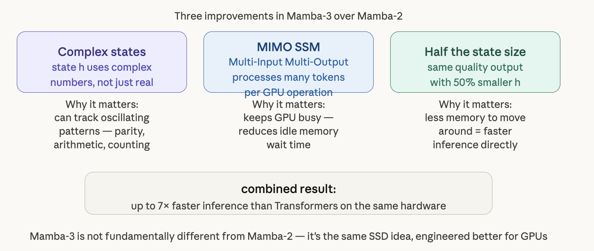

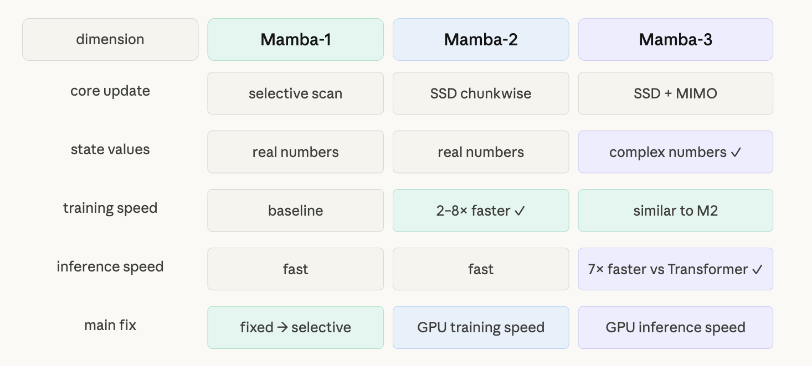

### The plot twist — Hybrids are winning

Here's what's actually happening in production right now. Pure Mamba has one weakness: retrieval-based weaknesses of fixed state-size mean linear layers will be predominantly used in hybrid models that mitigate this downside with quadratic self-attention layers.

In other words — Mamba is great at flowing through long sequences cheaply, but Transformers are still better at pinpoint retrieval (finding one specific fact buried in a huge document). So the industry has started combining both:
NVIDIA released Nemotron 3 Super — a 120B parameter hybrid Mamba-Transformer model — which uses SSM layers that read data linearly, with Transformer attention layers interleaved at regular intervals, achieving a 1-million-token context window through SSM efficiency while maintaining strong retrieval performance via the interleaved attention layers. IBM followed a similar path with its Granite 4.0 models, adopting a hybrid Mamba-Transformer architecture to reduce serving costs.

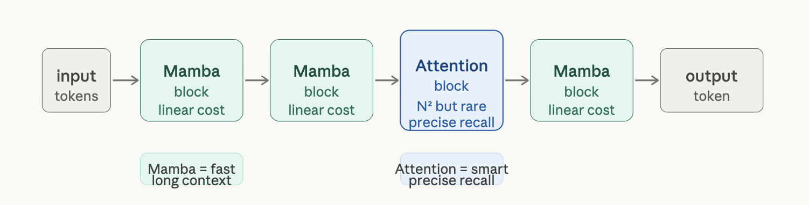

Most Mamba layers handle the cheap long-range processing. A few Transformer attention layers are sprinkled in where precise retrieval is needed. Best of both worlds.

```csv
| Transformer | Mamba | Hybrid
Cost per token | N² (expensive) | N (linear) | Between both 
Long contexts | Gets slow fast | Handles millions | Efficient
Precise retrieval | Excellent | Weaker | Good
Maturity | Very mature | Still young | Emerging
Used in production | Everywhere | Growing fast | NVIDIA, IBM
```

Mamba-3 is not "better than Transformers" in every dimension — fixed-state architectures still lag behind attention-based models when it comes to complex retrieval tasks. Medium But for long sequences and fast inference it's dramatically more efficient. The industry isn't replacing Transformers — it's absorbing Mamba into them.
