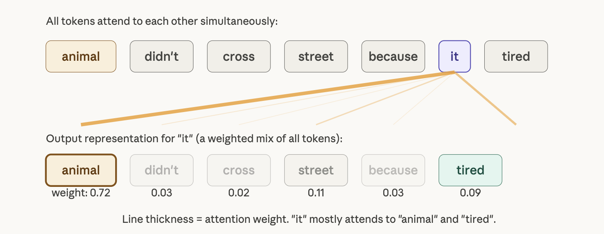
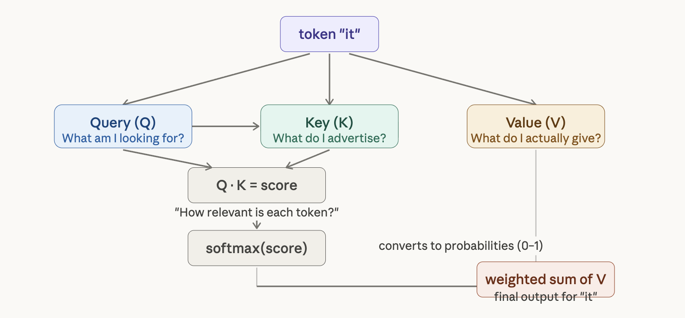
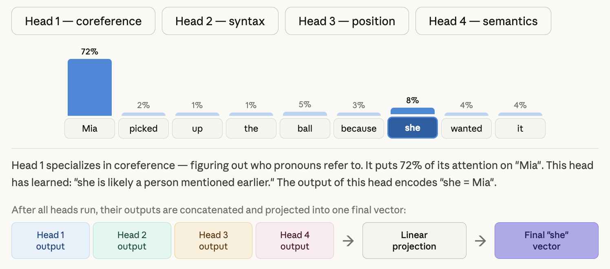
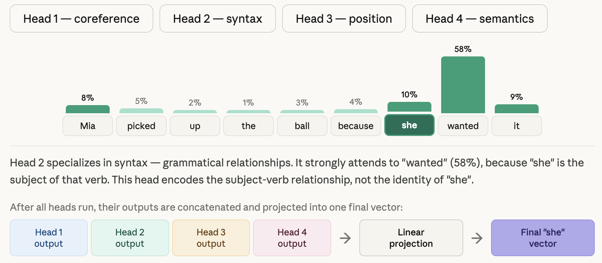
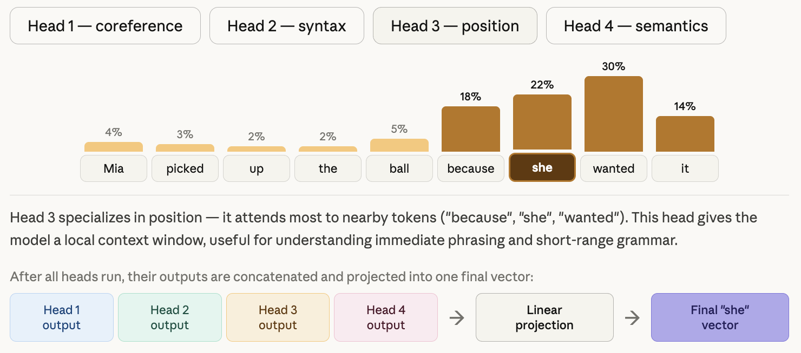
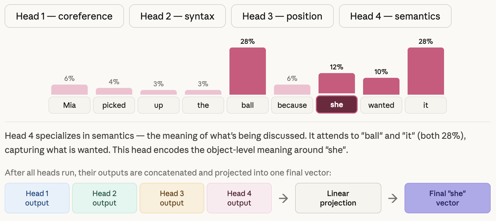
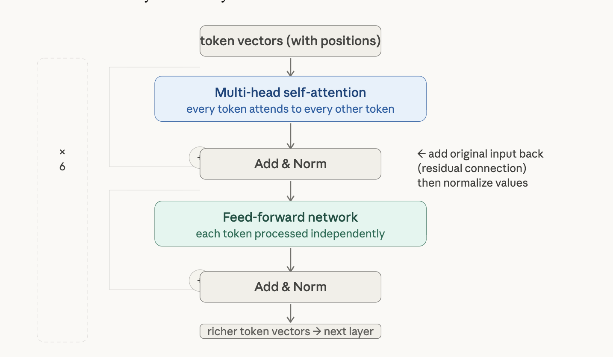
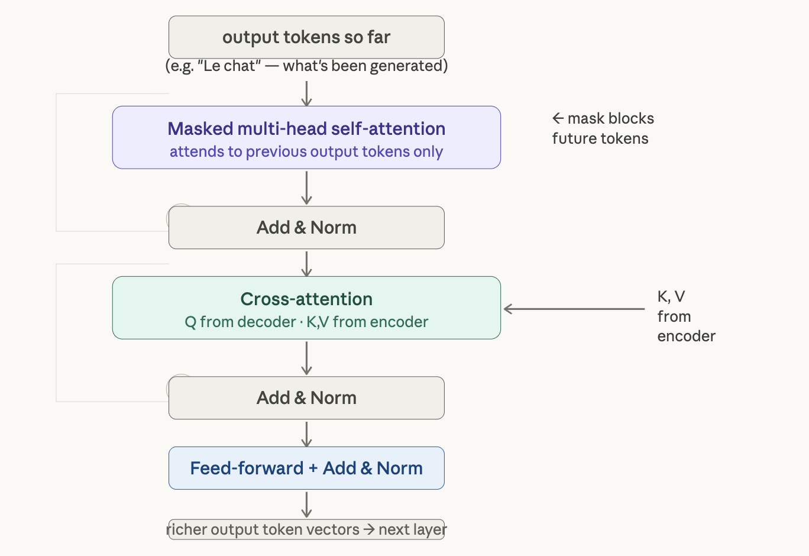

# LLM foundations

## Bullets

- A word can be multiple tokens, thumb rule: 1 token ~ 0.75 words
  - whitespace counts
  - non-english -> less efficient
  - emojis -> more tokens
- token limits = tokens(i/p) + tokens(o/p) + tokens(history)
- Building models stages:
  - pre training
    - Edge case: A pre-trained model with no fine-tuning will mimick the question, not answer you.
  - fine tuning
    - Edge case: Fine-tuning on a small, biased dataset can hurt a model — it can "forget" broad knowledge and overfit to the narrow examples.
  - RLHF
    - Edge case: RLHF can introduce sycophancy: the model learns that agreeable responses get rated higher, so it may tell you what you want to hear.
- Settings: Temp, Top-p, Top-k
  - Most used: Mild temp + High Top-p
  - Temp: controls creativity
  - Top-p: cuts the choices using probs
  - Top-k: simple cut
- Context windows:
  - definition: maximum amount of text the model can "see" at once
  - attention mechanism gave rise to context windows
  - longer the context -> increased latency, hallucinations creep in because history gets cut short to make way for new tokens
- Model families: small, mid-tier, flagship
  - various use cases use diff models
  - the training data, RLHF approach, and architecture choices all differ
- 'Attention is all you need' paper
  - solves RNNs' drawback
  - RNN: one token at a time, left to right
  - Transformers: parallelism
  - for every token, attention asks three questions about every other token: "Is this relevant to me?"
  - Attention = [Query, Key, Value]
    - Query: search query - what am I looking for
    - Key: Index - what do I advertise
    - Value: content - what do I actually give
    - Q.K = score -> relevancy
    - softmax(score)
- Multi-Head Attention
  - Each attention metrics in parallel
  - The head differ to each other based on weight

## Top-p working

Imagine the model is predicting the next word in two different sentences:

"The capital of France is ___" → "Paris" has ~99% probability. The distribution is sharp.
"She opened the door and saw a___" → hundreds of words could fit. The distribution is flat.

Top-k treats both situations identically — "keep the top 5 tokens, always." But that's a bad deal:

In the first case, keeping 5 tokens means including near-zero-probability garbage alongside "Paris."
In the second case, cutting to 5 tokens throws away hundreds of perfectly reasonable continuations.

Top-p adapts to the shape of the distribution. Instead of a fixed count, it says: "keep however many tokens it takes to cover X% of the total probability mass."

How it works, step by step:

- Raw probs: The model outputs a raw probability for every token in its vocabulary.
- Sort: Sort tokens from highest to lowest probability
- Cumulate: Add up probabilities from the top. The running total is the 'cumulative mass'. We stop when it reaches 0.90.
- Apply cutoff: Everything after the 0.90 threshold is zeroed out.
- Resample: The surviving tokens are renormalized so they sum to 1.0, then sampled.

This is what makes Top-p special. With top-p = 0.90:

- On a sharp distribution (one token has 95% probability) → the cutoff is hit after just 1 token. Pool size = 1. The model essentially always picks that token.
- On a flat distribution (10 tokens each at ~9%) → you need all 10 to reach 90%. Pool size = 10.

Edge cases you should know

- p = 1.0 is NOT the same as "random." It just means "don't cut anything." The model still weights heavily toward probable tokens. Combined with low temperature, p=1.0 is actually quite conservative.
- The pool can be size 1. If "Paris" has 97% probability and p=0.90, the cutoff is hit after the first token. The model will always say "Paris." Top-p silently collapses to greedy decoding in these moments.
- Renormalization happens after cutting. Once low-probability tokens are removed, the remaining probabilities are rescaled to sum to 1.0. So "stranger" at 24% in the full distribution might become ~27% in the filtered pool — it gets a slight boost just by being a survivor.
- Top-p and temperature interact. Temperature reshapes the distribution before Top-p is applied. High temperature flattens the curve, so Top-p needs more tokens to reach the threshold — the pool gets bigger. Low temperature sharpens it, so the pool shrinks. They're applied in sequence, not independently.
- Top-p doesn't fix a bad distribution. If the model is genuinely confused and has near-uniform probability across 10,000 tokens, Top-p = 0.9 gives you a pool of ~9,000 tokens — which is still chaos. Top-p is a filter, not a quality guarantee.

## Attention Is All You Need - In detail

- Drawbacks of RNN
  - The "One-at-a-Time" Problem (Sequential Processing)
  - Difficulty Connecting Distant Words (Long-Range Dependencies)
  - Memory and Scaling Constraints

### How attention solved RNN's drawbacks

__Solving Long-Range Dependencies (Connecting Distant Words)__

In an RNN, to understand that "barked" refers to the "dog," the information must travel through every word in between ("which," "was," "brown," etc.). The "signal" often gets lost along the way.

The Q, K, V Solution:

- When the model processes the word "barked," it creates a Query that essentially asks: "Who did the barking?"
- Every other word in the sentence has a Key. The Key for "dog" says, "I am a noun/animal."
- The model calculates a "compatibility" score (a weight) between the Query ("barked") and all Keys ("the," "dog," "brown," etc.).
- Because the Query for "barked" matches the Key for "dog" very well, the model gives the Value of "dog" a very high weight.

Result: The model connects "barked" to "dog" in one single step (O(1) operations), no matter how many words are between them

__Solving the Speed Problem (Parallelism)__

RNNs must wait for word t−1 to finish before they can start word t, making them very slow.

The Q, K, V Solution: In the Transformer, we don't need the previous word to calculate the current one. We can pack all the Queries, Keys, and Values for the entire sentence into large grids (attention matrices) and calculate them all at once using powerful computer chips (GPUs).

Result: This removes the sequential bottleneck, allowing models to be trained on massive amounts of data in a fraction of the time.

In the Transformer architecture, the process of calculating attention weights is known as Scaled Dot-Product Attention
. This mechanism determines how much "focus" or "weight" one word should place on every other word in a sequence.

Using the example sentence "The dog barked," here is the step-by-step process for calculating the weights for the word "barked":

1. The Input: Q, K, and V
For every word in the sentence, the model generates three vectors: a Query (Q), a Key (K), and a Value (V).
To calculate weights for "barked", we use its Query (q_barked) to "search" through the Keys (k) of all words in the sentence: "The", "dog", and "barked".

2. Step 1: Compute Compatibility (Dot Product)
The model calculates a "compatibility score" by taking the dot product of the Query with every Key.
Example: We multiply q_barked by k_The, q_barked by k_dog, and q_barked by k_barked.

The Result: This gives us raw scores. If the Query for "barked" (looking for a subject) matches the Key for "dog" (identifying as a noun/subject), that score will be high.

3. Step 2: Scaling
The raw scores are divided by the square root of the dimension of the keys (sqrt(d_k)).

Why? The authors found that for large vector dimensions, dot products can grow very large, pushing the next step (softmax) into regions with extremely small gradients, which makes training difficult. Scaling keeps the numbers manageable.

4. Step 3: Softmax (The Weight Calculation)
The model applies a softmax function to the scaled scores.
The Result: This turns the scores into probabilities (weights) that sum to 1.

Example: After softmax, the weights might look like: "The" (0.05), "dog" (0.85), "barked" (0.10). This tells the model that to understand "barked," it must pay 85% of its attention to "dog".

5. Step 4: Weighted Sum (The Final Representation)
Finally, these weights are multiplied by the Value (V) vectors of each word.
The model takes 85% of the information from the "dog" Value, 5% from "The," and 10% from "barked" to create the final representation for the word "barked" in that layer.

Summary Formula: In practice, the Transformer performs this for the whole sentence at once using matrices:

`Attention(Q,K,V) = softmax(Q * K_t / sqrt(d_k))V`.

In the Transformer architecture, the dimension of keys (d_k) refers to the length or size of the vector that represents each "Key" (and each "Query") in the attention mechanism
. In the base model described in the sources, d_k is set to 64.

The "scaling" part of the mechanism is used to counteract a specific mathematical problem that occurs when these vectors get larger.

An Example of Scaling in Action
Imagine we are comparing two words, and we have two different versions of our model: one with a small d_k
​and one with a large d_k.

Small Dimension (d_k=4):

The dot product of a Query and Key might result in a raw score of 10.
sqrt(d_k) = 2.

The scaled score is 10/2=5.

Large Dimension (d_k=100):
Because the vectors are much longer, the dot product might result in a much larger raw score, like 250.
sqrt(d_k) = 10.

The scaled score is 250/10=25.

__How softmax function works__

In the Transformer architecture, the softmax function is the mathematical tool used to convert raw, scaled scores into weights (probabilities) that sum to exactly 1
. This allows the model to decide exactly how much "attention" to pay to each word in a sequence.

The Role of Softmax in Attention
After the model calculates the compatibility between a Query and all Keys (the dot product) and scales those scores, it uses the softmax function to normalize them.

The process works in three conceptual steps:

- Exponentiation: It takes each score and raises e (the mathematical constant) to the power of that score. This ensures all values are positive and makes larger scores stand out significantly more than smaller ones.
- Summation: It adds up all these exponentiated values.
- Normalization: It divides each exponentiated value by the total sum.

A Concrete Example

Imagine the model is processing the word "barked" in the sentence: "The dog barked."
Let’s say the scaled dot product scores (the raw compatibility scores) between the Query for "barked" and the Keys for each word are:

- "The": 1.5
- "dog": 4.0
- "barked": 0.5

Applying Softmax:

- Step 1: The function calculates e^1.5≈4.48, e^4.0≈54.60, and e^0.5≈1.65.
- Step 2: It sums them up: 4.48+54.60+1.65=60.73.
- Step 3: It divides each by the sum to get the final Attention Weights:
  - "The": 4.48/60.73≈0.07 (7%)
  - "dog": 54.60/60.73≈0.90 (90%)
  - "barked": 1.65/60.73≈0.03 (3%)

The Result: The softmax function has turned the raw scores into a clear instruction: "To understand 'barked,' give 90% of your attention to 'dog'".

### Multi-Head attention

Multi-Head Attention is the process of running the Scaled Dot-Product Attention mechanism multiple times in parallel. Instead of having one single, large "search" (attention head), the model performs several smaller, specialized searches simultaneously.

The most important reason for having multiple heads is that it allows the model to jointly attend to information from different places and for different reasons.

Example: In the sentence "The dog barked," one head might focus on the grammatical relationship (linking the verb "barked" to the noun "dog"). A second head might focus on descriptive adjectives (linking "dog" to "brown").

The Limitation of Single-Head: If the model only had one head, it would be forced to average all these different relationships together, which the authors noted "inhibits" the model's ability to understand complex structures.

For sentence: `Mia picked up the ball because she wanted it`, here is how a multi head would work:

Head-1:

Head-2:

Head-3:

Head-4

Once all 8 heads have finished their individual calculations, the model has 8 different "Value" outputs.
Concatenation: These 8 outputs are "glued" together (concatenated) to form a single long vector.
Final Projection: This long vector is then multiplied by a final weight matrix (W^O) to bring it back to the original size of d_model=512.

- This is the fundamental way heads are distinguished. For each head (i), the model uses a unique set of learned linear projections (weight matrices): WQ_i, WK_i, and WV_i. Because each head starts with different initial weights and is updated independently during training, each one "sees" the input differently. These unique weights allow each head to project the input into a different "representation subspace".
- The training process decides. No human programmer tells "Head 1" to look at grammar or "Head 2" to look at adjectives. Instead, these roles emerge naturally as the model learns to minimize its error during training. The authors observed that after training, individual heads clearly learned to perform specific tasks. Some heads focused on the syntactic structure (like identifying which noun a verb belongs to), while others focused on semantic relationships. By having multiple heads, the model avoids the problem of "averaging" all these different relationships into one messy signal.
- The researchers (the model's architects) decide. The number of heads (represented by the variable h) is a hyperparameter, which is a setting chosen before the training starts.

### Transformers

The Transformer architecture is a system designed to process language "all at once" rather than one word at a time. By removing the old sequential method (RNNs), it allows for massive speed and a better understanding of how distant words in a sentence relate to each other.

The Transformer Framework

- Core Innovation: It relies solely on self-attention to draw global dependencies between inputs and outputs, allowing for significantly more parallelization during training compared to traditional sequential models.
- Efficiency: Because it reduces the number of operations required to relate distant words to a constant O(1), it is much faster to train and reaches a higher quality state-of-the-art in less time.
- Positional Encoding: Since the model lacks recurrence, it injects positional encodings into the input and output embeddings to ensure it understands the relative and absolute positions of words in a sequence.

Here is how the architecture fits together:

1. Preparing the Input (Embeddings & Positional Encoding)
    Because the Transformer does not process words in order like an RNN, it would normally "forget" which word comes first
    - To fix this, it takes word vectors (embeddings) and adds Positional Encodings
    - These are mathematical signals that tell the model exactly where each word sits in the sentence
2. The Encoder: Understanding the Input
    The "left side" of the Transformer is the Encoder, which consists of a stack of six identical layers. Its job is to create a deep understanding of the input sentence (e.g., an English sentence). Each layer contains two main sub-layers: a multi-head self-attention mechanism and a position-wise fully connected feed-forward network.
    - Self-Attention: Each layer uses the Multi-Head Attention (Q, K, V) mechanism we discussed. This allows every word to "look" at every other word in the sentence simultaneously to find connections
    - Feed-Forward Networks: After the attention step, the model passes the information through a simple "processing" layer to refine the results.
    - Residual Connections: To keep the training stable, the original input is added back to the output at each step (like a shortcut), followed by Layer Normalization.
3. The Decoder: Generating the Output
    The "right side" is the Decoder, which also has six layers. It is "auto-regressive," meaning it predicts one word, then uses that word to help predict the next.
    - Masked Self-Attention: When the decoder is learning, it uses a mask to hide future words. This prevents the model from "cheating" by looking at the correct answer before it tries to guess it.
    - Encoder-Decoder Attention: This is the bridge between the two halves. The Decoder sends out a Query to the Encoder's Keys and Values. This allows the decoder to focus on the most relevant parts of the original English sentence while it is busy writing the German translation.
4. The Final Output (Linear & Softmax)
    At the very top of the Decoder, the model produces a vector of numbers. It passes these through a final Softmax layer
    - This turns those numbers into probabilities for every word in its vocabulary, allowing the model to choose the most likely next word (e.g., choosing "Hund" for "dog").

Encoder stack:

Decoder stack:

Why this "All-at-Once" structure works:

- Constant Path Length: Unlike RNNs, where a signal must travel word-by-word, the Transformer connects any two words in a constant number of operations (O(1)).
- Extreme Parallelism: Because there is no waiting for the previous word to finish, the entire sentence can be processed at once by a GPU, making training significantly faster than any model that came before it.
